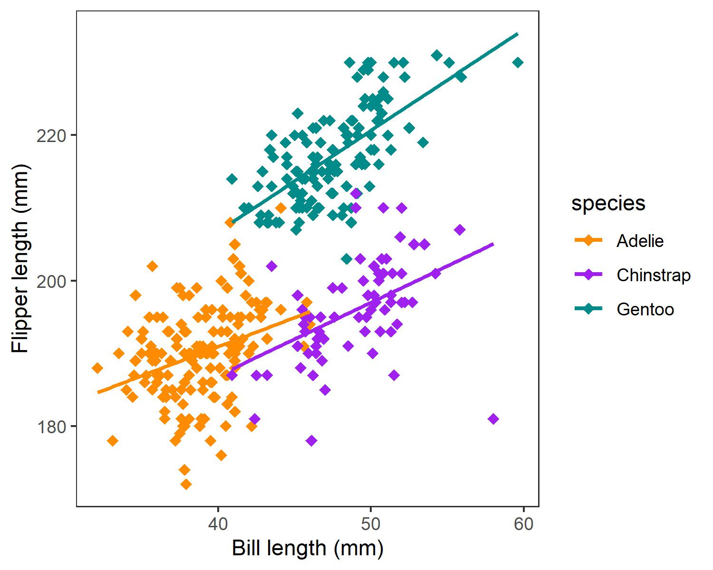

```{r global_options, include = FALSE}
# Specify positioning of plots
knitr::opts_chunk$set(fig.pos = 'H')
```

```{r setup, include = FALSE}
knitr::opts_chunk$set(echo = TRUE)

# Load necessary packages
library("ggplot2")
library("cowplot")
library("grateful")
library("palmerpenguins")

# Load data
penguins <- read.csv("../00_rawdata/penguins.csv")

# Set plotting parameters
theme_set(theme_bw() +
            theme(panel.grid.major = element_blank(), 
                  panel.grid.minor = element_blank()))

scan_packages() 

# Limits the reference list to selected packages
# get_pkgs_info(pkgs = c("palmerpenguins","tidyverse", "renv"), out.dir = "../04_manuscript/")

# Outputs versions for all packages
# get_pkgs_info(out.dir = "../04_manuscript/")
```

**Title**: Everybody loves penguins! Relationships between bill and flipper length in three species of penguins from the Palmer Archipelago

Jennifer M.T. Magel^1^\*

1.  Department of Forest & Conservation Sciences, University of British Columbia, Vancouver, Canada

\*Corresponding Author

Email: jenn.magel\@gmail.com

**Data Availability:** The data and code that support the findings of this study are openly available on GitHub at <https://github.com/jmagel/BIOL548T_penguins>.

**Conflict of Interest statement**

The author declares no conflicts of interest.

\newpage

# Abstract

Everyone loves penguins! Antarctica is amazing and its penguins are the coolest, so we decided to study those. We studied three species of penguins: Adelie (*Pygoscelis adeliae*), Chinstrap (*Pygoscelis antarcticus*), and Gentoo (*Pygoscelis papua*) from three islands in the Palmer Archipelago. How do the various measurements (e.g., bill length, flipper length) of penguins correlate to each other? We assumed that penguins with longer bills would also have longer flippers, otherwise they would be disproportionate. But we weren't sure, so we decided to check using a very useful dataset from the 'palmerpenguins' R package, which was collected at the Palmer Station in Antarctica. We found that there was, indeed, a positive relationship between bill and flipper length in all three species of penguin. While we were at it, we also decided to compare the body measurements of penguins of the same species from different islands. We found that ... This study provides valuable information on Antarctic penguins, which can maybe somehow be used to inform future research.

**Keywords**: penguins, Antarctica, Palmer Archipelago, Adelie penguin, Chinstrap penguin, Gentoo penguin, morphometrics

# Introduction

Penguins are a favourite subject of study among biologists, on account of their adorable waddle and their mysterious nature as denizens of the largely undiscovered Antarctic continent (let us ignore, for a moment, the penguins that exist outside of Antarctica). Because so many people love penguins, they are well worth studying.

Understanding the relationships between morphometric variables (e.g., bill length and flipper length) in penguins can help us to discover many fascinating things about them. For example, bill length is known to be correlated with sex in both Chinstrap and Gentoo penguins [@lee_new_2015]. Therefore, we wanted to further explore the relationship between various morphometric variables in Antarctic penguin populations.

# Methods

To examine the relationship between bill and flipper length in our three chosen species of penguins, we used data collected by Dr. Kristen Gorman and the Palmer Station, Antarctica LTER [@gorman_ecological_2014]. This dataset contains data on 344 individual penguins that were measured on three islands in the Palmer Archipelago, Antarctica (Biscoe, Dream, Torgerson) in the austral summers of 2007/08, 2008/09, and 2009/10. Data was accessed using the 'palmerpenguins' R package [@horst_palmerpenguins_2020]. Examination of differences in morphometrics for penguins from different islands was also accomplished using the 'palmerpenguins' dataset [@horst_palmerpenguins_2020].

```{r results = 'asis', echo = FALSE}
# To print a text summary of all the packages used in the project (and their versions) using the 'grateful' package
cite_packages(output = "paragraph", out.dir = "../03_manuscript/", omit = c("knitr", "tinytex"))
```

Code for all statistical analyses are publicly available on GitHub (<https://github.com/jmagel/BIOL548T_penguins>).

# Results

We observed a positive relationship between bill length and flipper length for all three species of penguins (Fig. 1). Gentoo and Chinstrap penguins had a similar range of bill lengths, but Gentoo penguins had longer flippers on average. Adelie and Chinstrap penguins had similar flipper lengths, but Chinstrap penguins had longer bills.

```{r figure_01, echo = FALSE, message = FALSE, warning = FALSE, out.width="70%", fig.align = "center"}

```

**Figure 1**. Relationship between bill length and flipper length in three species of *Pygoscelis* penguins from the Palmer Archipelago, Antarctica. Trend lines represent linear regressions fit using the 'geom_smooth()' function in ggplot.

We also found ...

[INSERT FIGURE 2]

**Figure 2.**

# Discussion

Hooray for penguins! Our analysis demonstrates that penguins are amazing and that everyone should love and appreciate them. Penguins, which exhibit a beautiful relationship between bill and flipper lengths, can being joy and happiness to our lives. Too bad they are so far away in Antarctica...

# References

:::{#refs}
:::